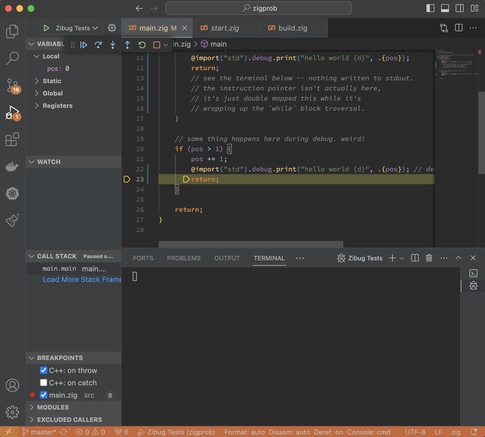

# About

This repo demonstrates some strange debugging behavior in VS Code, where
precisely **not** taking a branching statement (like a `while` loop or `if`)
results in `CodeLLDB` briefly displaying that the instruction pointer has immediately jumped
to the end of the **inside** of the control flow block.

# Steps to reproduce

1. Use any version of Zig `>=0.11.0` (latest test just now was done with `0.12.0-dev.2059+42389cb9c`)
2. In VS Code, ensure `CodeLLDB` is installed along with `Ziglang` tools.
3. `zig build`
4. Set a breakpoint on line 8 of `src/main.zig`.
5. In debugger view on the left (run button with a bug in bottom left corner), run `Zibug`.
6. Step through, observe debugger briefly reports that it is about to execute the last statement **inside** the while loop, which is strictly impossible for at least two reasons:

- a) The predicate guarding each block **must** have evaluated to false, because `(0 > 1) == false`.

- b) The last statement of each control flow block is immediately preceded by a print statement. If we were actually about to execute the last statement of the `while/if` loop, we would `stdout`, but we actually see nothing. 

# Example screenshots:

